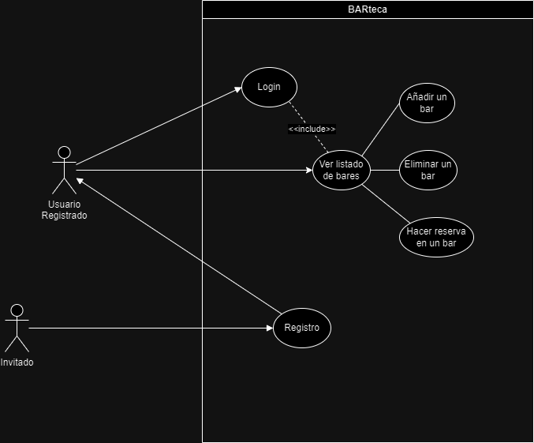
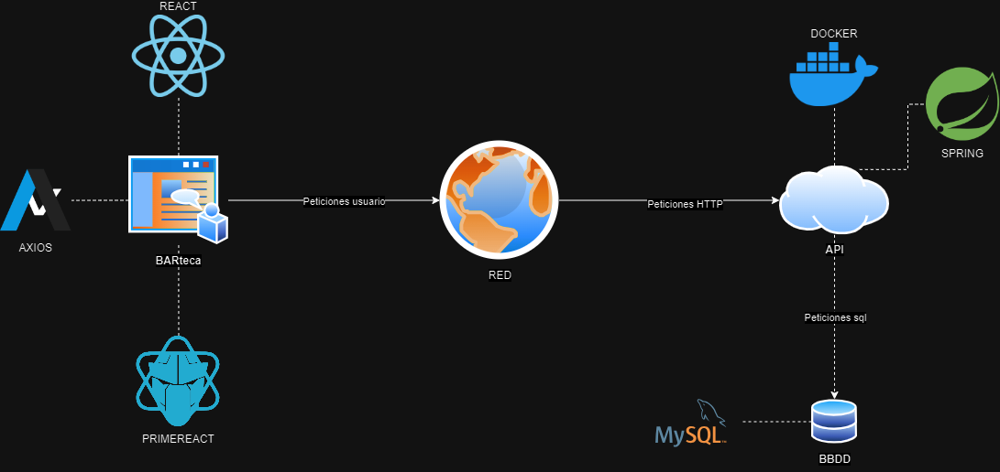

# PROYECTO FIN DE GRADO

[Enlace al repositorio V2](https://github.com/acascoc098/BARteca-V2.git)

Andrea Castilla Cocera
2º DAM


## **INTRODUCCIÓN**

   Alguna vez has viajado a una ciudad y te apetecía tomar algo, pero te encuentras siempre el mismo problema, ¿dónde? Puedes tener amigos que te ayuden y te aconsejen, pero si no conoces a nadie que haya visitado esa ciudad o no conozca un sitio para *tapear* es difícil.

   Este proyecto está enfocado en una web dirigida a una “*biblioteca*” de bares, donde puedes añadir bares, hacer reservas, calificar, etc.

   Como una especie de *Booking* pero de bares, donde podemos ver un listado con los bares con información de estos, por ejemplo, su ciudad, nombre, contacto, valoración,… Y con acciones como son: *añadir un bar, eliminar un bar, hacer una reserva en ese bar*, etc.

   Podríamos decir que es un foro o un blog donde las personas encuentran una interfaz donde encontrar un sitio para tomarse algo y reservar un hueco para cualquier momento que quieran ir o volver al mismo bar.

   Además, se incluye una parte de *registro* y *login* para usuarios, con esto conseguimos que no cualquiera pueda hacer todas las funciones que tiene alguien logueado, por ejemplo, crear una entrada de un bar.

## **TECNOLOGÍAS**

   Este proyecto está dividido en dos partes, en una encontramos el frontend, con los componentes que hacen que la aplicación tenga funcionalidad y, por otra parte, encontramos el backend, donde gestionamos los *endpoints* y BBDD.

   Veamos que encontramos en cada parte.

### ***FRONTEND***

   [Enlace frontend V1](https://github.com/acascoc098/project-frontend-V1.git)

   → ***React***

   Es una biblioteca de JavaScript desarrollada por Facebook que se utilizapara construir interfaces de usuario interactivas y reutilizables. Es una de lasbibliotecas más populares y ampliamente utilizadas para el desarrollo de aplicaciones web.
   Algunas de las características de ***React*** son :

   1. Componentes reutilizables: ***React*** permite construir interfaces de usuariodivididas en componentes reutilizables así cada componente encapsula su propio estado y lógica, lo que nos facilita su reutilización en diferentes partes de una aplicación.
   1. Virtual DOM: ***React*** utiliza un modelo de representación virtual del DOM (DocumentObject Model). En lugar de actualizar directamente el DOM cada vez que cambia el estado deun componente, ***React*** compara el virtual DOM con el DOM real y realiza solo loscambios necesarios, lo que mejora el rendimiento y la eficiencia de la aplicación.
   1. JSX: ***React*** utiliza *JSX* como una extensión de *JavaScript* para definir laestructura de los componentes y su apariencia. *JSX* combina *HTML* y *JavaScript* en unsolo archivo, lo que facilita la escritura y comprensión del código.

   La elección de ***React*** para mi proyecto viene dada a la comodidad con la que trabajo con este y con la variedad de opciones que puedes implementar con las librerías de componentes, de las que hablaré más adelante.

   Para crear una aplicación con react necesitamos tener unos requisitos como son instalar:

   - Node.js: [Instalar Node.js](https://nodejs.org/)
   - npm: Generalmente incluido con Node.js

   Y posteriormente para crearlo desde una terminal proporcionamos los siguientes comandos:

   ```sh
   npx create-react-app my-app
   cd my-app
   ```

   Para movernos fácilmente a este proyecto desde una terminal de *Git Bash*, debemos situarnos en la carpeta, abrir la terminal y simplemente escribir el siguiente comando:

   ```sh
   code .
   ```

   Con esto nos abrirá una ventana en *Visual Studio*, el IDE que he utilizado para este proyecto, situándonos en la carpeta raíz del proyecto y mostrándonos las diferentes subcarpetas con todo lo necesario. En este caso yo la he creado en una carpeta general donde encontramos la parte de la documentación y la parte del código, tanto backend como frontend.

   En ***React*** nos encontramos con la siguiente estructura:
   - *src* -> Nos encontramos con los componentes de la aplicación y los archivos ***JavaScript***
   - *public* -> Aquí vemos los archivos estáticos, como son las imágenes, y el archivo *index.html* (En este es donde hacemos os cambios 'generalísimos')

   Por último, nos encontramos en el archivo *package.json* una serie de scripts que nos servirán de ayuda:

   ```json
   "scripts": {
    "start": "react-scripts start", -> Iniciar la aplicación
    "build": "react-scripts build", -> Contruir la aplicación
    "test": "react-scripts test",   -> Ejecutar pruebas
    "eject": "react-scripts eject"  -> Expulsar configuraciones ocultas
  }
   ```

   Además, nos encontramos con las dependecias que hemos utilizado o necesitado en la creación de nuestro proyecto:

   ```json
   "dependencies": {
    "@emailjs/browser": "^4.3.3",
    "@testing-library/jest-dom": "^5.17.0",
    "@testing-library/react": "^13.4.0",
    "@testing-library/user-event": "^13.5.0",
    "axios": "^1.6.8",
    "bcryptjs": "^2.4.3",
    "bcryptjs-react": "^2.4.6",
    "cors": "^2.8.5",
    "primeflex": "^3.3.1",
    "primeicons": "^7.0.0",
    "primereact": "^10.6.6",
    "react": "^18.3.1",
    "react-dom": "^18.3.1",
    "react-final-form": "^6.5.9",
    "react-router-dom": "^6.23.1",
    "react-scripts": "5.0.1",
    "web-vitals": "^2.1.4"
  }
   ```

   Las cuales las instalamos con el siguiente comando:

   ```sh
   npm install "nombre-dependencia"
   ```

   Además, cuento con ***Axios***, una tecnología que implementamos en el grado y la cuál nos ayuda a manejar las peticiones *HTTP*. A continuación hablamos de esta parte.

   → ***Axios***: es una biblioteca de *JavaScript* que permite realizar solicitudes *HTTP* desde una aplicación web.

   Veamos sus características:

   1. Sintaxis sencilla: ***Axios*** nos permite de una manera clara y sencilla realizar peticiones *HTTP* a nuestro backend en este caso aunque puede ser cualquier dirección *HTTP*
   1. Admite promesas: ***Axios*** permite el manejo de promesas debido a que utiliza promesas basadas en el estándar *Promise* de *JavaScript*
   1. Compatibilidad con navegadores: Permite utilizar el navegador lo cual lo hace muy útil desde el punto de vista del cliente

   Para la instalación de ***Axios*** haremos los que hemos visto anteriormente:

   ```sh
   npm install axios
   ```

   Con esto ya podremos importar ***Axios*** en nuestro proyecto utilizando:

   ```js
   import axios from 'axios';
   ```

   Podemos indicarle unas configuración global:

   ```js
   const axiosInst = axios.create({
      baseUrl: 'url-api',
      timeout: 1000,
      headers: {'hader': 'foobar'}
   });
   ```

   En mi caso solo he indicado la URL de la API en su componente:

   ```js
   const URL = 'http://localhost:8080/barteca';
   ```

   Con ***Axios*** podemos hacer uso de peticiones GET y POST de manera sencilla junto al manejo de errores y añadiendo su uso con *hooks* (con los que podemos manejar los estados).

   → ***PrimeReact***: es una librería de componentes de ***React***, esta nos facilita el uso de componentes generales y su diseño, como son botones, popups, inputs, etc. Con esto tenemos un desarrollo de interfaz más ágil y una creación de la misma más cómoda.

   Para su instalación seguimos la dinámica:

   ```sh
    npm install primereact
   ```

   Además, podemos instalar dependencias como los iconos o *primeflex* para las utilidades *CSS*.

   Para importar en nuestro proyecto este, debemos seguir la mecánica, pero importando lo que necesitamos o queremos implementar, ya sean componentes, hojas de estilo, temas... De la siguiente forma:

   ```js
   import 'primeicons/primeicons.css';
   import { InputText } 'primeicons/inputtext';
   import { SpeedDial } from 'primereact/speeddial';
   import 'primeicons/primeicons.css';
   ```

   Gracias a esta librería he creado la validación de los formularios para añadir o crear y se puede apoyar también con los *hooks*.

   -> ***Email JS***

   EmailJS es una biblioteca que facilita el envío de correos electrónicos desde aplicaciones JavaScript sin necesidad de un servidor backend. Aquí están sus principales características:

   1. Facilidad de uso: Simplifica el envío de correos desde el front-end sin configurar un servidor SMTP.
   1. Compatibilidad con servicios populares: Soporta Gmail, Outlook, Yahoo, y otros servicios SMTP.
   1. Plantillas de correo: Permite crear y gestionar plantillas desde su panel de control.
   1. Integración con formularios HTML: Facilita el envío del contenido de formularios a tu correo electrónico.
   1. Seguridad: Maneja credenciales de servicios de correo de forma segura.
   1. Soporte para archivos adjuntos: Permite enviar correos con archivos adjuntos.
   1. Panel de control: Ofrece herramientas para ver el historial de correos y gestionar plantillas.
   1. Compatibilidad con múltiples lenguajes: Puede integrarse con aplicaciones en diversos lenguajes mediante sus API.
   1. Eventos y callbacks: Permite manejar eventos y realizar acciones adicionales tras el envío de correos.
   1. Documentación completa: Proporciona ejemplos y guías detalladas para facilitar la implementación.

   Para instalar esta librería se utiliza lo visto anteriormente:

   ```sh
   npm install emailjs-com
   ```

   Además de importarla donde la utilicemos:

   ```js
   import emailjs from 'emailsjs-com';
   ```

   Para el uso de este creamos una función indicada en la parte de implementación, a continuación, vemos un ejemplo que nos proporciona la misma web para implementarlo con ***React***:

   ```js
   import React, { useRef } from 'react';
   import emailjs from '@emailjs/browser';

   export const ContactUs = () => {
   const form = useRef();

   const sendEmail = (e) => {
      e.preventDefault();

      emailjs
         .sendForm('YOUR_SERVICE_ID', 'YOUR_TEMPLATE_ID', form.current, {
         publicKey: 'YOUR_PUBLIC_KEY',
         })
         .then(
         () => {
            console.log('SUCCESS!');
         },
         (error) => {
            console.log('FAILED...', error.text);
         },
         );
   };

   return (
      <form ref={form} onSubmit={sendEmail}>
         <label>Name</label>
         <input type="text" name="user_name" />
         <label>Email</label>
         <input type="email" name="user_email" />
         <label>Message</label>
         <textarea name="message" />
         <input type="submit" value="Send" />
      </form>
   );
   };
   ```

### ***BACKEND***

   [README del backend](./backend/project-backend/README.md)

   [Enlace del backend V1](https://github.com/acascoc098/project-backend.git)

   → ***Spring***

   Spring es un framework de código abierto que da soporte al desarrollo de aplicaciones basadas en Java mediante el uso de objetos sencillos.

   Tiene una estructura modular y gran flexibilidad para implementar diferentes tipos de estructura según las necesidades de la aplicación que vayamos a realizar.

   Algunas de las características de ***Spring*** son :

   1. Funciona sobre JVM

      **¿Qué es JVM?** : La *JVM* es la encargada de traducir las códigos bytes de Java a las instrucciones nativas de la máquina del host permitiendo así el funcionamiento de la aplicación.

   2. Estructura modular

      El hecho de que sea modular permite que tenga una estructura muy flexible a la hora de trabajar , ya que al tener distintos módulos con distintas funcionalidades esto permite que el trabajo sea más organizado y a la hora de reutilizar dicho trabajo nos será más sencilla su exportación.

   3. Nos permite hacer todo tipo de aplicaciones

      - Aplicaciones que acceden a base de datos vía SQL
      - Esquemas de seguridad clásica
      - Aplicaciones escalables en el paso del tiempo

   Me he decantado por el uso de ***Spring*** debido a la flexibilidad , viabilidad y seguridad que este nos ofrece.

   Para crear un proyecto con ***Sprin Boot***  debemos ir a la página de [Spring Initializr](https://start.spring.io/) y seleccionar la opciones de versiones, lenguaje, nombre, depencencias,...

   

   Nos dará una carpeta comprimida con el proyecto y con este ya podemos ponernos manos a la obra.

   La estructura de carpetas es la siguiente:

   - src/main/java -> Código fuente
   - com.example.demo -> Paquete principal del proyecto
   - src/main/resources -> Recursos del proyecto, aquí nos encontramos con un *.sql* el cual se ejecutará al momento de inicializar la aplicación
   - src/test -> Pruebas del proyecto

   En esta aplicación veremos los modelos, repositorios y controladores, estó lo tengo indicado en la documentación del backen: 
   [README del backend](./../backend/project-backend/README.md)

   → ***Docker***

   ***Docker*** es una plataforma de código abierto que permite a los desarrolladores automatizar la implementación de aplicaciones dentro de contenedores de software. Estos contenedores son entornos ligeros, portátiles y autosuficientes que incluyen todo lo necesario para ejecutar una aplicación, incluyendo el código, las bibliotecas, las dependencias y la configuración necesaria.

   Sus características son:

   1. Portabilidad: Los contenedores Docker pueden ejecutarse en cualquier sistema con Docker instalado (servidor local, nube pública, nube privada o entorno híbrido), garantizando que las aplicaciones funcionen de manera consistente en cualquier entorno.

   2. Aislamiento: Cada contenedor ejecuta aplicaciones de manera aislada, evitando que los procesos dentro de un contenedor interfieran con los de otros, lo que mejora la seguridad y estabilidad de las aplicaciones.

   3. Eficiencia: A diferencia de las máquinas virtuales, los contenedores comparten el mismo núcleo del sistema operativo y son más ligeros, permitiendo ejecutar más contenedores en la misma infraestructura sin sobrecargar el sistema.

   4. Gestión de Dependencias: Docker empaqueta todas las bibliotecas y componentes necesarios dentro del contenedor, simplificando la gestión de dependencias y resolviendo problemas de "funciona en mi máquina" debido a diferencias en los entornos.

   5. Ecosistema Extenso: Docker cuenta con un amplio ecosistema, incluyendo Docker Hub, un repositorio en línea donde los desarrolladores pueden compartir y obtener imágenes de contenedores preconfiguradas.

   Para utilizar este debemos descargar primero [Docker Desktop](https://www.docker.com/products/docker-desktop/).

   Al ser parte del backend he creado una carpeta en este donde tengo el archivo con la configuración de los contenedores '*/stack-spring*', en esta encontramos varios archivos, como el archivo de los contenedores:

   ```yml
   version: '3.1'

   services:
   db:
      image: mysql
      restart: "no"
      environment:
         MYSQL_ROOT_USERNAME: ${MYSQL_ROOT_USERNAME}
         MYSQL_ROOT_PASSWORD: ${MYSQL_ROOT_PASSWORD}
      networks:
         - mysql_network
      ports:
         - 33306:3306
      volumes:
         - mysql_data:/var/lib/mysql
         - ./init.sql:/docker-entrypoint-initdb.d/init.sql

   adminer:
      image: adminer
      restart: "no"
      networks:
         - mysql_network
      ports:
         - 8181:8080

   networks:
   mysql_network:

   volumes:
   mysql_data:
   ```

   Donde nos encontramos la configuración de estos, como los puertos, la versión, ...

   Complementado con un archivo *.env* con configuración para estos:

   ```
   MYSQL_ROOT_USERNAME=username
   MYSQL_ROOT_PASSWORD=password
   ```

   Y un archivo para a creación de la base de datos al levantar los contenedores:

   ```sql
   CREATE DATABASE IF NOT EXISTS `barteca`;
   ```

   Para levantar los contenedores o iniciar los servicios debemos situarnos en la carpeta donde tenemos el archivo *.yml* y utilizar el siguiente comando:

   ```sh
   docker-compose up -d
   ```

   Para construir un contenedor utilizamos el siguiente comando:

   ```sh
   docker build -t
   ```

   Y para ejecutarlos usamos el siguiente comando:

   ```sh
   docker run -d
   ```

   Estos dos últimos comandos los podemos reemplazar gracias a ***Docker Desktop*** con sus funciones de interfaz, además en este podemos encontrar muchas acciones que nos ayudan a configurar los contenedores.

### ***OTRAS***

   → ***MYSQL***

   ***MySQL*** es un sistema de gestión de bases de datos relacional (RDBMS) de código abierto muy popular y ampliamente utilizado en el desarrollo de aplicaciones web y empresariales.

   Sus características son:

   1. Código Abierto: Aunque existen versiones comerciales, la versión comunitaria de ***MySQL*** es de código abierto y gratuita, lo que permite a los desarrolladores y organizaciones usarla sin costo.

   2. Alto Rendimiento: ***MySQL*** está optimizado para un alto rendimiento en consultas y transacciones, lo que lo hace adecuado para aplicaciones de alta demanda.

   3. Escalabilidad: Soporta bases de datos de tamaño pequeño a muy grande, y puede manejar un alto número de conexiones simultáneas.

   4. Seguridad: Proporciona características avanzadas de seguridad, como cifrado *SSL*, autenticación segura y permisos de usuario granulares.

   5. Compatibilidad: Funciona en múltiples plataformas, incluyendo Linux, Windows y macOS, y es compatible con muchos lenguajes de programación, como *PHP, Java, Python y C++.*

   6. Soporte y Comunidad: ***MySQL*** tiene una amplia comunidad de usuarios y desarrolladores que contribuyen al desarrollo del software y ofrecen soporte a través de foros y documentación en línea.

   → ***PlantUML***

   ***PlantUML*** es una herramienta de código abierto que permite crear diagramas a partir de texto escrito en un lenguaje de especificación simple y legible. Es especialmente popular entre desarrolladores y equipos de software porque facilita la creación rápida y sencilla de diagramas que se integran bien con el control de versiones y los flujos de trabajo de desarrollo ágil.

   Características de ***PlanUML***:

   1. Simplicidad: Utiliza un lenguaje de marcado sencillo para definir diagramas, sin necesidad de herramientas complejas.

   1. Variedad de Diagramas: Soporta diversos tipos de diagramas como secuencia, clases, casos de uso, actividades, entre otros.

   1. Integración: Se integra fácilmente con IDEs, sistemas de control de versiones y herramientas de documentación.

   1. Automatización: Puede ser utilizado en scripts de automatización y generar diagramas dinámicamente.

   1. Exportación: Permite exportar diagramas en múltiples formatos gráficos como PNG, SVG, y PDF, lo que facilita su inclusión en documentación y presentaciones.

## ANÁLISIS

### DIAGRAMAS DE PROYECTO FIN DE GRADO

En estos diagramas mostramos como se comporta nuestra aplicación junto a la API.

#### DIAGRAMAS DE SECUENCIA


#### DIAGRAMA DE CASO DE USO



#### DIAGRAMA DE CLASES


#### DIAGRAMA DE ARQUITECTURA



# IMPLEMENTACIÓN

Aquí ponemos ejemplos de código:

## CONFIGURACIÓN SPRING

Aquí vemos la clase donde tenemos la configuración para el backend:

```java
    @Bean
    SecurityFilterChain filter(HttpSecurity http) throws Exception {
        return http
                .authorizeHttpRequests((requests) -> requests
                        .requestMatchers("/barteca/**", "/usuario/**", "/bar/**", "/reserva/**", "/login/**").permitAll()
                )
                .exceptionHandling((exception) -> exception
                        .accessDeniedPage("/denegado"))
                .formLogin((formLogin) -> formLogin
                        .permitAll())
                .rememberMe(Customizer.withDefaults())
                .logout((logout) -> logout
                        .invalidateHttpSession(true)
                        .logoutSuccessUrl("/")
                        .permitAll())
                .csrf((csrf) -> csrf.disable())
                .cors(Customizer.withDefaults())
                .build();
    }

    @Autowired
    public void configure(AuthenticationManagerBuilder auth) throws Exception {
        auth.jdbcAuthentication()
                .dataSource(dataSource)
                .usersByUsernameQuery("select username, password from usuario where username = ?")
                .authoritiesByUsernameQuery("select username "
                                                + "from usuario "
                                                + "where username = ?");

    }
```

## FRONTEND

En la parte del frontend tenemos una clase para acceder a la api, para obtener los bares o reservas, por ejemplo:

```js
    const URL = 'http://localhost:8080/barteca';

    const getBares = async (state) => {
    const token = localStorage.getItem('token'); // Obtener el token
    if (!token) {
        console.error('No token found, redirecting to login');
        window.location.href = "/";
        return;
    }

    try {
        const req = await axios.get(URL + '/bar', {
        headers: {
            'Authorization': `Bearer ${token}`
        },
        withCredentials: true
        });
        console.log(req);
        state(req.data);
    } catch (error) {
        console.error('Error fetching data:', error);
        if (error.response && error.response.status === 401) {
        window.location.href = "/";
        }
    }
    };
```

En esta clase implementamos además *axios*.

Además nos encontramos con un ***AuthProvider***, donde vemos como se implementa el logout:

```js
const logout = () => {
        localStorage.removeItem('token');
        localStorage.removeItem('usuario');
        dispatch({ type: 'LOGOUT' });
    };
```

Para la parte del registro tenemos un componente donde llamamos a la siguiente función enviando los datos necesarios para registrar un usuario:

```js
const registerUser = async (data) => {
  try {
      const response = await axios.post(`${URL}/usuario`, data);
      console.log('Registro exitoso:', response.data);
  } catch (error) {
      console.error('Error registrando usuario:', error);
  }
};
```

Para la parte de un nuevo bar vemos lo siguiente:

```js
const nuevoBar = async (data) => {
  try {
      const response = await axios.post(`${URL}/bar`, data);
      console.log('Registro exitoso:', response.data);
  } catch (error) {
      console.error('Error registrando usuario:', error);
  }
};
```

Y la misma estructura de la función la podemos encontrar para las reservas.

Por último, podemos ver la implementación de Email JS en el componente de la creación de reservas:

```js
const sendEmail = (form) => {
    
        emailjs
          .sendForm('service_xxoz70p', 'template_tcjyzo6', form, {
            publicKey: 'cOCPBrPWdhn-blN8F',
          })
          .then(
            () => {
              console.log('SUCCESS!');
            },
            (error) => {
              console.log('FAILED...', error.text);
            },
          );
      };
```

Donde los datos de *.sendForm* los encontramos en la página, menos *form*.
