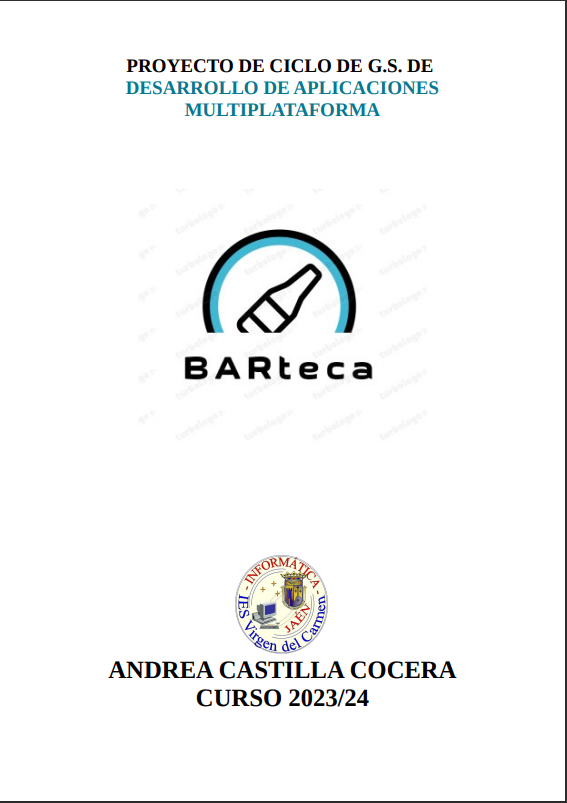

Andrea Castilla Cocera
2º DAM

# **INTRODUCCIÓN**

   Alguna vez has viajado a una ciudad y te apetecía tomar algo, pero te encuentras siempre el mismo problema, ¿dónde? Puedes tener amigos que te ayuden y te aconsejen, pero si no conoces a nadie que haya visitado esa ciudad o no conozca un sitio para *tapear* es difícil.

   Este proyecto está enfocado en una web dirigida a una “*biblioteca*” de bares, donde puedes añadir bares, hacer reservas, calificar, etc.

   Como una especie de *Booking* pero de bares, donde podemos ver un listado con los bares con información de estos, por ejemplo, su ciudad, nombre, contacto, valoración,… Y con acciones como son: *añadir un bar, eliminar un bar, hacer una reserva en ese bar*, etc.

   Podríamos decir que es un foro o un blog donde las personas encuentran una interfaz donde encontrar un sitio para tomarse algo y reservar un hueco para cualquier momento que quieran ir o volver al mismo bar.

   Además, se incluye una parte de *registro* y *login* para usuarios, con esto conseguimos que no cualquiera pueda hacer todas las funciones que tiene alguien logueado, por ejemplo, crear una entrada de un bar.

# **TECNOLOGÍAS**

   Este proyecto está dividido en dos partes, en una encontramos el frontend, con los componentes que hacen que la aplicación tenga funcionalidad y, por otra parte, encontramos el backend, donde gestionamos los *endpoints* y BBDD.

   Veamos que encontramos en cada parte.

### ***FRONTEND***

   → ***React***

   Es una biblioteca de JavaScript desarrollada por Facebook que se utilizapara construir interfaces de usuario interactivas y reutilizables. Es una de lasbibliotecas más populares y ampliamente utilizadas para el desarrollo de aplicaciones web.
   Algunas de las características de ***React*** son :

   1. Componentes reutilizables: ***React*** permite construir interfaces de usuariodivididas en componentes reutilizables así cada componente encapsula su propio estado y lógica, lo que nos facilita su reutilización en diferentes partes de una aplicación.
   1. Virtual DOM: ***React*** utiliza un modelo de representación virtual del DOM (DocumentObject Model). En lugar de actualizar directamente el DOM cada vez que cambia el estado deun componente, ***React*** compara el virtual DOM con el DOM real y realiza solo loscambios necesarios, lo que mejora el rendimiento y la eficiencia de la aplicación.
   1. JSX: ***React*** utiliza *JSX* como una extensión de *JavaScript* para definir laestructura de los componentes y su apariencia. *JSX* combina *HTML* y *JavaScript* en unsolo archivo, lo que facilita la escritura y comprensión del código.

   La elección de ***React*** para mi proyecto viene dada a la comodidad con la que trabajo con este y con la variedad de opciones que puedes implementar con las librerías de componentes, de las que hablaré más adelante.

   Además, cuento con ***Axios***, una tecnología que implementamos en el grado y la cuál nos ayuda a manejar las peticiones *HTTP*. A continuación hablamos de esta parte.

   → ***Axios***: es una biblioteca de *JavaScript* que permite realizar solicitudes *HTTP* desde una aplicación web.

   Veamos sus características:

   1. Sintaxis sencilla: ***Axios*** nos permite de una manera clara y sencilla realizar peticiones *HTTP* a nuestro backend en este caso aunque puede ser cualquier dirección *HTTP*
   1. Admite promesas: ***Axios*** permite el manejo de promesas debido a que utiliza promesas basadas en el estándar *Promise* de *JavaScript*
   1. Compatibilidad con navegadores: Permite utilizar el navegador lo cual lo hace muy útil desde el punto de vista del cliente

   → ***PrimeReact***: es una librería de componentes de ***React***, esta nos facilita el uso de componentes generales y su diseño, como son botones, popups, inputs, etc. Con esto tenemos un desarrollo de interfaz más ágil y una creación de la misma más cómoda.

### ***BACKEND***

   [Enlace del backend](https://github.com/acascoc098/project-backend.git)

   → ***Spring***

   Spring es un framework de código abierto que da soporte al desarrollo de aplicaciones basadas en Java mediante el uso de objetos sencillos.

   Tiene una estructura modular y gran flexibilidad para implementar diferentes tipos de estructura según las necesidades de la aplicación que vayamos a realizar.

   Algunas de las características de ***Spring*** son :

   1. Funciona sobre JVM

      **¿Qué es JVM?** : La *JVM* es la encargada de traducir las códigos bytes de Java a las instrucciones nativas de la máquina del host permitiendo así el funcionamiento de la aplicación.

   2. Estructura modular

      El hecho de que sea modular permite que tenga una estructura muy flexible a la hora de trabajar , ya que al tener distintos módulos con distintas funcionalidades esto permite que el trabajo sea más organizado y a la hora de reutilizar dicho trabajo nos será más sencilla su exportación.

   3. Nos permite hacer todo tipo de aplicaciones

      - Aplicaciones que acceden a base de datos vía SQL
      - Esquemas de seguridad clásica
      - Aplicaciones escalables en el paso del tiempo

   Me he decantado por el uso de ***Spring*** debido a la flexibilidad , viabilidad y seguridad que este nos ofrece.

   → ***Docker***

   ***Docker*** es una plataforma de código abierto que permite a los desarrolladores automatizar la implementación de aplicaciones dentro de contenedores de software. Estos contenedores son entornos ligeros, portátiles y autosuficientes que incluyen todo lo necesario para ejecutar una aplicación, incluyendo el código, las bibliotecas, las dependencias y la configuración necesaria.

   Sus características son:

   4. Portabilidad: Los contenedores Docker pueden ejecutarse en cualquier sistema con Docker instalado (servidor local, nube pública, nube privada o entorno híbrido), garantizando que las aplicaciones funcionen de manera consistente en cualquier entorno.

   5. Aislamiento: Cada contenedor ejecuta aplicaciones de manera aislada, evitando que los procesos dentro de un contenedor interfieran con los de otros, lo que mejora la seguridad y estabilidad de las aplicaciones.

   6. Eficiencia: A diferencia de las máquinas virtuales, los contenedores comparten el mismo núcleo del sistema operativo y son más ligeros, permitiendo ejecutar más contenedores en la misma infraestructura sin sobrecargar el sistema.

   7. Gestión de Dependencias: Docker empaqueta todas las bibliotecas y componentes necesarios dentro del contenedor, simplificando la gestión de dependencias y resolviendo problemas de "funciona en mi máquina" debido a diferencias en los entornos.

   8. Ecosistema Extenso: Docker cuenta con un amplio ecosistema, incluyendo Docker Hub, un repositorio en línea donde los desarrolladores pueden compartir y obtener imágenes de contenedores preconfiguradas.

### ***OTRAS***

   → ***MYSQL***

   ***MySQL*** es un sistema de gestión de bases de datos relacional (RDBMS) de código abierto muy popular y ampliamente utilizado en el desarrollo de aplicaciones web y empresariales.

   Sus características son:

   1. Código Abierto: Aunque existen versiones comerciales, la versión comunitaria de ***MySQL*** es de código abierto y gratuita, lo que permite a los desarrolladores y organizaciones usarla sin costo.

   2. Alto Rendimiento: ***MySQL*** está optimizado para un alto rendimiento en consultas y transacciones, lo que lo hace adecuado para aplicaciones de alta demanda.

   3. Escalabilidad: Soporta bases de datos de tamaño pequeño a muy grande, y puede manejar un alto número de conexiones simultáneas.

   4. Seguridad: Proporciona características avanzadas de seguridad, como cifrado *SSL*, autenticación segura y permisos de usuario granulares.

   5. Compatibilidad: Funciona en múltiples plataformas, incluyendo Linux, Windows y macOS, y es compatible con muchos lenguajes de programación, como *PHP, Java, Python y C++.*

   6. Soporte y Comunidad: ***MySQL*** tiene una amplia comunidad de usuarios y desarrolladores que contribuyen al desarrollo del software y ofrecen soporte a través de foros y documentación en línea.

   → ***PlantUML***

   ***PlantUML*** es una herramienta de código abierto que permite crear diagramas a partir de texto escrito en un lenguaje de especificación simple y legible. Es especialmente popular entre desarrolladores y equipos de software porque facilita la creación rápida y sencilla de diagramas que se integran bien con el control de versiones y los flujos de trabajo de desarrollo ágil.

   Características de ***PlanUML***:

   1. Simplicidad: Utiliza un lenguaje de marcado sencillo para definir diagramas, sin necesidad de herramientas complejas.

   1. Variedad de Diagramas: Soporta diversos tipos de diagramas como secuencia, clases, casos de uso, actividades, entre otros.

   1. Integración: Se integra fácilmente con IDEs, sistemas de control de versiones y herramientas de documentación.

   1. Automatización: Puede ser utilizado en scripts de automatización y generar diagramas dinámicamente.

   1. Exportación: Permite exportar diagramas en múltiples formatos gráficos como PNG, SVG, y PDF, lo que facilita su inclusión en documentación y presentaciones.
