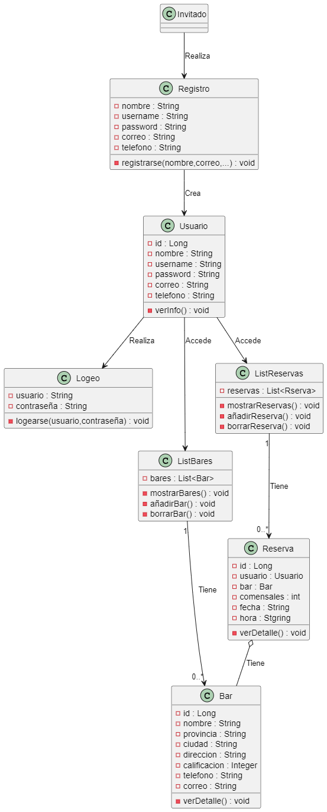

# DIAGRAMAS DE PROYECTO FIN DE GRADO

En estos diagramas mostramos como se comporta nuestra aplicación junto a la API.

## DIAGRAMAS DE SECUENCIA

## DIAGRAMA DE CASO DE USO

## DIAGRAMA DE CLASES

## DIAGRAMA DE ARQUITECTURA

